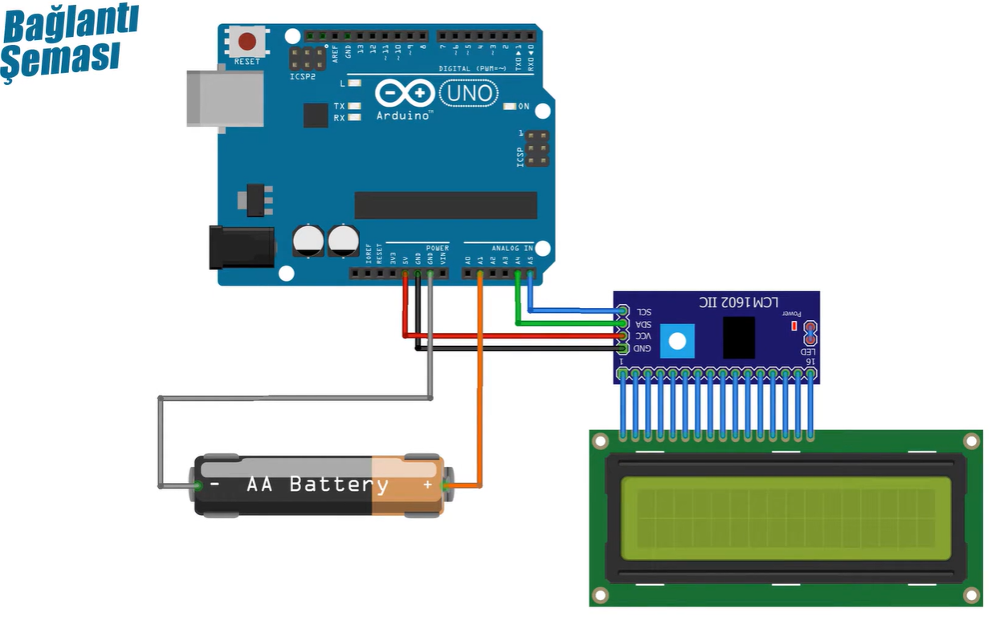

# Arduino Pil Ölçer 🔋

Bu projede Arduino kullanılarak düşük voltajlı bir pilin gerilimi ölçülmüş ve LCD ekranda gösterilmiştir.

## Projenin Amacı
Düşük voltajlı bir pilin (1.5V – 3.7V aralığı) gerilimini Arduino üzerinden ölçmek ve sonucu LCD ekranda göstermek.

## Kullanılan Malzemeler
- Arduino Uno
- LCD 16x2
- Pil (1.5V veya 3.7V)
- Jumper kablolar

> Bu projede **breadboard ve gerilim bölücü kullanılmamıştır**.

## Çalışma Prensibi
Pil gerilimi doğrudan Arduino’nun analog giriş pinine bağlanmıştır.  
Ölçülen pil gerilimi Arduino’nun 5V sınırının altında olduğu için ek bir gerilim bölücü devresi kullanılmamıştır.  

Arduino analog pininden okunan değer hesaplanarak gerçek gerilim değeri elde edilir ve LCD ekranda gösterilir.

## Bağlantı Şeması
Projeye ait bağlantı şeması aşağıda gösterilmiştir.

### Temel Bağlantılar
- Pil (+) → Arduino A0  
- Pil (–) → Arduino GND  

### Arduino – LCD Bağlantıları
- LCD VSS → GND  
- LCD VDD → 5V  
- LCD RS → Arduino dijital pin  
- LCD E → Arduino dijital pin  
- LCD D4–D7 → Arduino dijital pinler  
- LCD RW → GND  

## Arduino Kodu
Projede kullanılan Arduino kodu `pil_olcer.ino` dosyasında bulunmaktadır.

## Notlar
- Bu proje yalnızca **düşük voltajlı piller** için uygundur.
- 5V üzeri piller doğrudan Arduino’ya bağlanmamalıdır.
- Daha yüksek voltajlı piller için gerilim bölücü kullanılması zorunludur.
